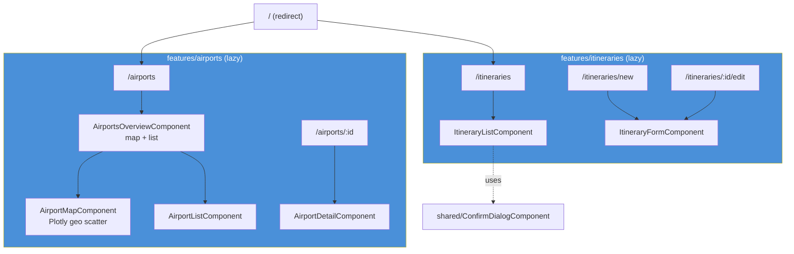
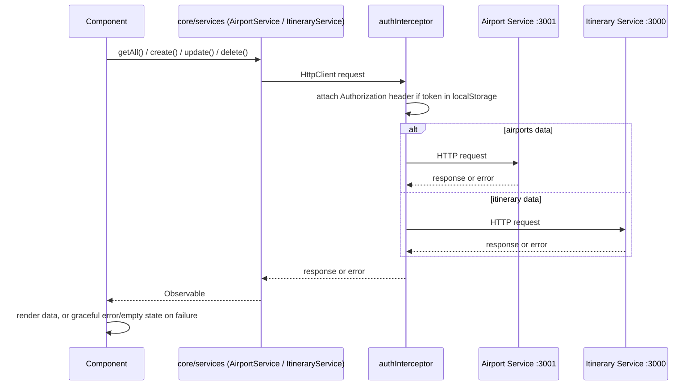

# Architecture diagrams

Reference diagrams for the frontend. See the [frontend-angular skill](../.claude/skills/frontend-angular/SKILL.md)
for the conventions these diagrams describe, and the backend repo's
`docs/architecture.md` for the full system view (services, database, broker).

## App structure / routing

## Request flow

**Rule enforced by this diagram:** the frontend never has a direct edge to
`api-colombia.com` — all airport data flows through Airport Service.

## Ticket sequencing note

Both feature areas (`airports`, `itineraries`) already have working
components, routes, and services against the real backend contracts. When
picking up a frontend ticket, check whether it's asking for a **new** screen
or hardening an **existing** one (validation edge case, loading/error state,
auth) — most of the remaining backlog for the frontend is the latter.
